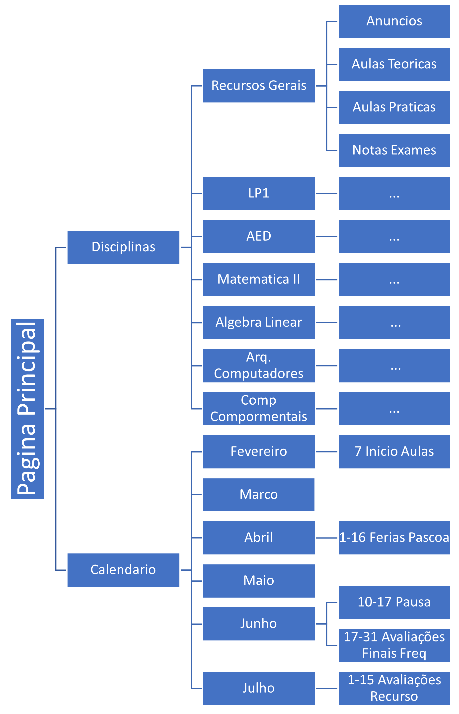

# Exercício em grupo

- Neste exercício o aluno irá implementar um conjunto de menus interativos, ao qual mostra conteúdo semelhante à estrutura existente no Moodle da Universidade Lusófona.

## Conteúdo esperado:



## Regras:

- O aluno deverá implementar o código em C.
- Quando chegamos no fim da árvore de opções, o programa deve imprimir `Opcao X escolhida`, onde `X` deve ser substituído pelo número da opção `e volta a imprimir o menu`.
- O menu de calendário deve imprimir o calendário conforme o diagrama acima e onde não houver eventos, mostrar `Nenhum evento`.

## Exemplo de execução:

```bash
1 - Disciplinas
2 - Calendario 
0 - Sair 
>1
1 - Recursos Gerais
2 - LP1
3 - AED
4 - Matematica II
5 - Algebra Linear
6 - Arq. Computadores
7 - Comp Compormentais 
0 - Sair 
>3
1 - Anuncios
2 - Aulas Teoricas
3 - Aulas Praticas
4 - Notas Exames 
0 - Sair 
>3
Opcao 3 escolhida 
1 - Anuncios
2 - Aulas Teoricas
3 - Aulas Praticas
4 - Notas Exames 
0 - Sair 
>0
1 - Recursos Gerais
2 - LP1
3 - AED
4 - Matematica II
5 - Algebra Linear
6 - Arq. Computadores
7 - Comp Compormentais 
0 - Sair 
>0
1 - Disciplinas
2 - Calendario 
0 - Sair 
>2
1 - Fevereiro 
2 - Marco 
3 - Abril 
4 - Maio
5 - Junho
6 - Julho  
0 - Sair 
>6
1-15 Avaliações Recurso  
0 - Sair 
1 - Fevereiro 
2 - Marco 
3 - Abril 
4 - Maio
5 - Junho
6 - Julho  
0 - Sair 
>4
Opcao 4 escolhida 
1 - Fevereiro 
2 - Marco 
3 - Abril 
4 - Maio
5 - Junho
6 - Julho  
0 - Sair 
>5
10-17 Pausa
17-31 Avaliacoes Finais Freq  
0 - Sair 
1 - Fevereiro 
2 - Marco 
3 - Abril 
4 - Maio
5 - Junho
6 - Julho  
0 - Sair 
>0
1 - Disciplinas
2 - Calendario 
0 - Sair 
>0
``` 

## Dicas:

- O aluno pode usar funções para organizar, simplificar e reutilizar o código.

## Entrega:

- Pandora: https://saturn.ulusofona.pt/
- Data limite: 24/03/2023 23:59:59